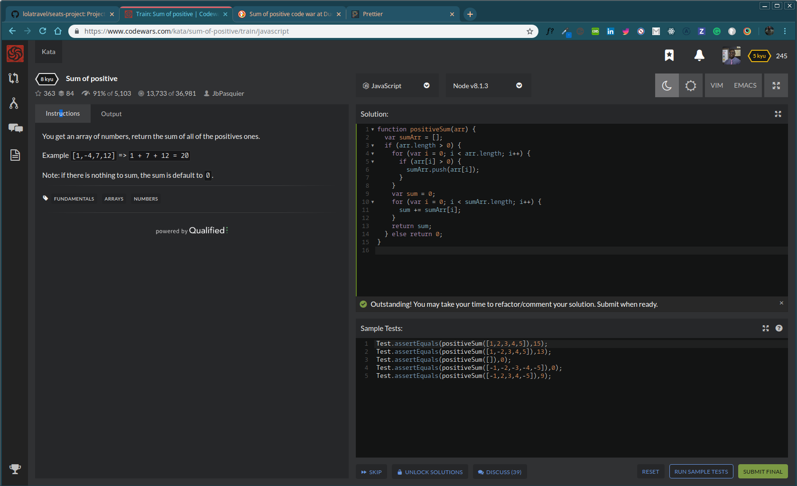

This project was done by .

# Coding War:

You get an array of numbers, return the sum of all of the positives ones.

Example [1,-4,7,12] => 1 + 7 + 12 = 20

Note: if there is nothing to sum, the sum is default to 0.

# Sum of Positive

This took me about 3 hours to complete. I ended up coming up with this solution by making a empty array `sumArr`, then checking if anything in that was positive and if that number in the array was positive to then push that number into the new array I declared`sumArr`. After I got all the positive numbers, I created the variable `sum` and return the sum. Implmented a for loop to go thru the `sumArr` and add it to that variable `sum` 

```

function positiveSum(arr) {
    var sumArr = [];
    if (arr.length > 0) {
      for (var i = 0; i < arr.length; i++) {
        if (arr[i] > 0) {
          sumArr.push(arr[i]);
        }
      }
      var sum = 0;
      for (var i = 0; i < sumArr.length; i++) {
        sum += sumArr[i];
      }
      return sum;
    } else return 0;
  }

```


# Clever solution


But I ened up seeing there was a more clever way of solving this code war by using ES6. Using `.filter()` & `.reduce()` with the arrow function was really unique.


```

function positiveSum (arr) {
  return arr.filter(x => x>=0).reduce((a, c) => a + c, 0);
}

```